# 제출 스크린샷 목록

| 파일명 | 설명 |
|---|---|
| 01_env_python_git_version.png | Python / Git 버전 확인 |
| 02_env_git_config.png | Git 사용자 정보 및 설정 확인 (`git config --list`) |
| 03_env_vscode_korean_pack.png | VSCode Korean Language Pack 설치 |
| 03_env_vscode_python_extension.png | VSCode Python 확장 설치 |
| 04_env_hello_print_test.png | `print("Hello")` 실행 테스트 |
| 05_env_git_clone_test.png | 공개 샘플 저장소 clone 및 로그 확인 |
| 06_run_menu.png | 프로그램 메뉴 화면 |
| 07_run_add_prompt.png | 프롬프트 추가 실행 |
| 08_run_list.png | 프롬프트 목록 |
| 09_run_category.png | 카테고리별 조회 |
| 10_run_search.png | 프롬프트 검색 |
| 11_run_detail.png | 프롬프트 상세 보기 |
| 12_run_favorite.png | 즐겨찾기 관리 |
| 13_run_crud.png | (보너스) 프롬프트 수정/삭제 |
| 14_run_top_views.png | (보너스) 조회수 기준 Top 목록 |
| 15_run_json_save_load.png | (보너스) JSON 저장/불러오기 |
| 16_run_markdown_export.png | (보너스) 카테고리별 Markdown 내보내기 |
| 17_data_structure_example.png | prompts 리스트/딕셔너리 데이터 구조 예시 |
| 18_git_log_graph.png | `git log --oneline --graph` 결과 |

---

## 이미지 미리보기

### 1. Python / Git 버전 확인
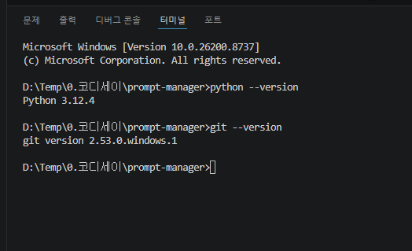

### 2. Git 설정 확인
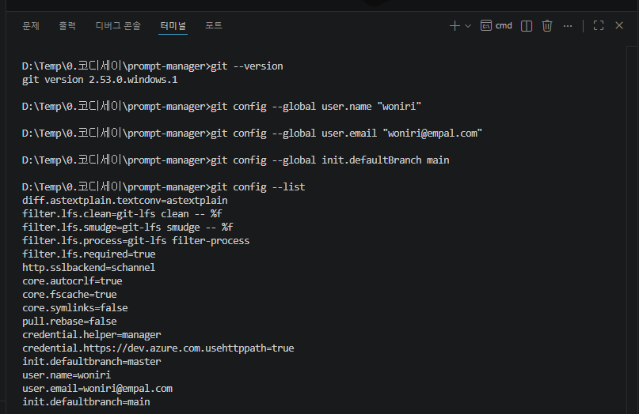

### 3. VSCode Korean Language Pack 설치
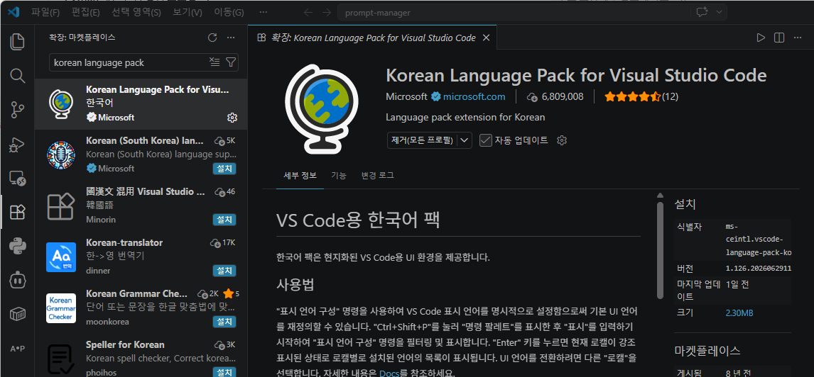

### 4. VSCode Python 확장 설치
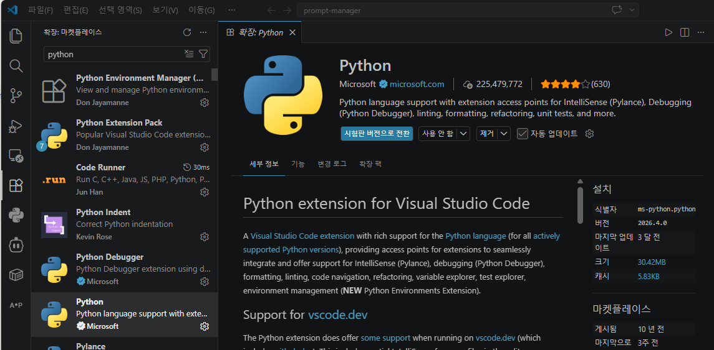

### 5. Hello 출력 테스트
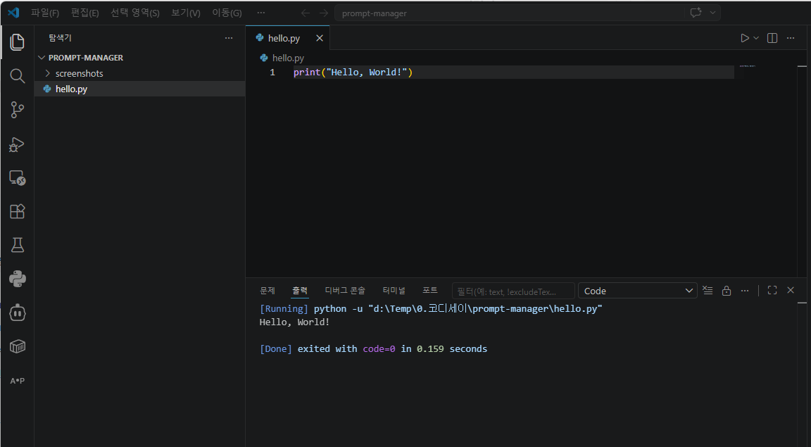

### 6. Git Clone 테스트
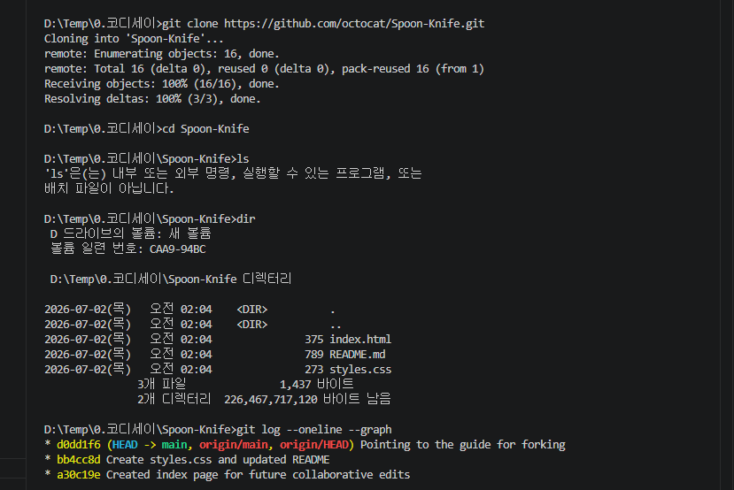

### 7. 프로그램 메뉴 화면
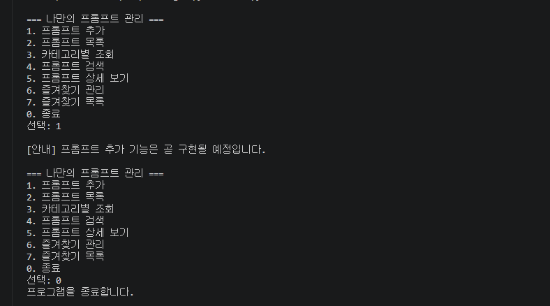

### 8. 프롬프트 추가
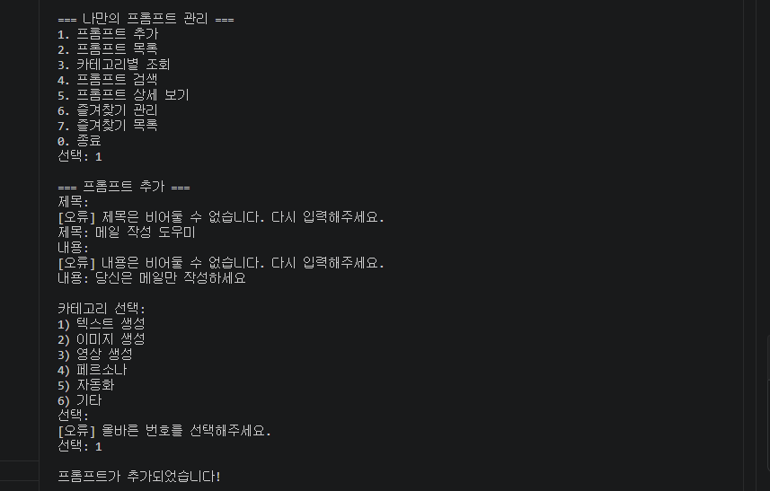

### 9. 프롬프트 목록
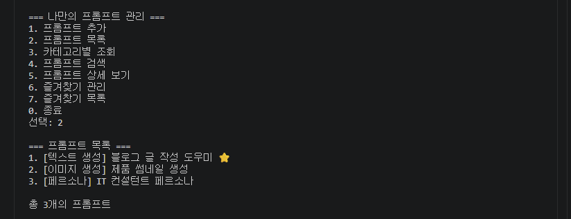

### 10. 카테고리별 조회
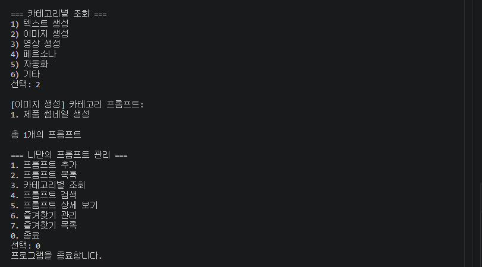

### 11. 프롬프트 검색
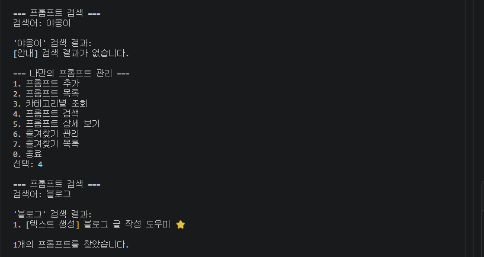

### 12. 프롬프트 상세 보기
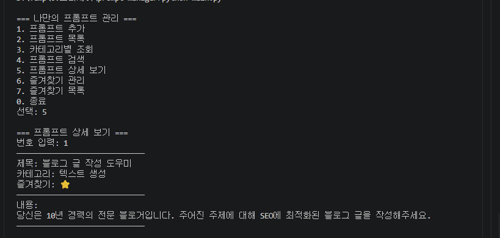

### 13. 즐겨찾기 관리
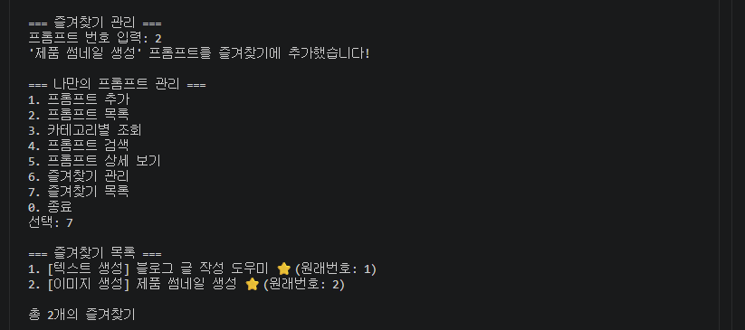

### 14. (보너스) 프롬프트 수정/삭제
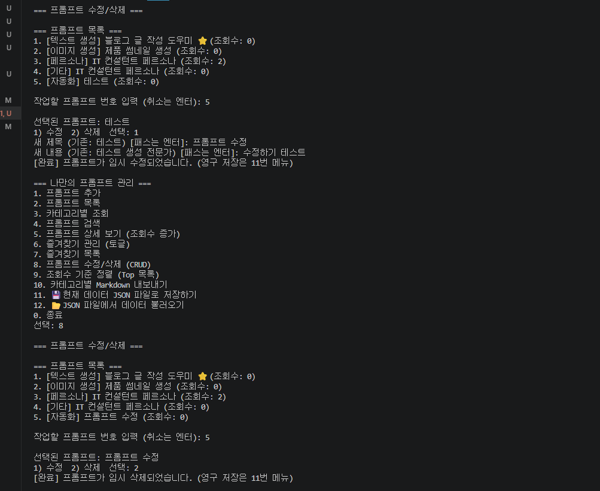

### 15. (보너스) 조회수 기준 Top 목록
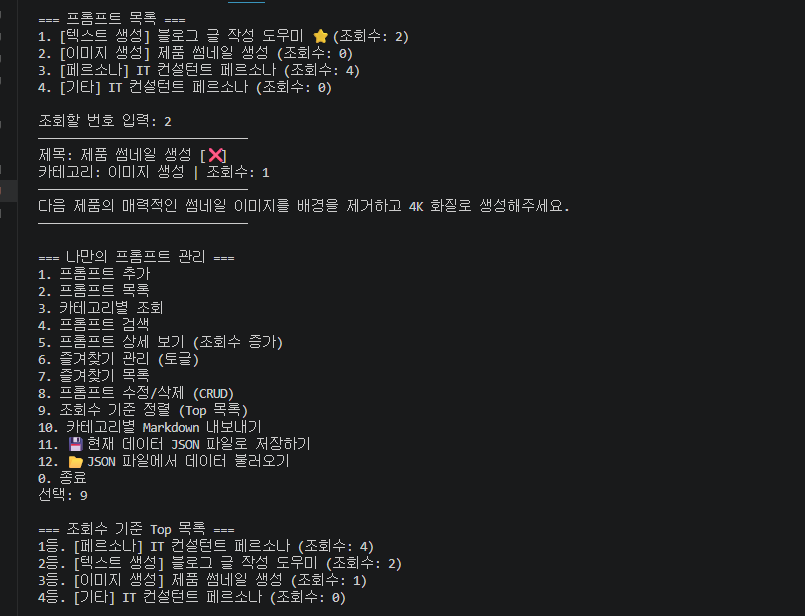

### 16. (보너스) JSON 저장/불러오기
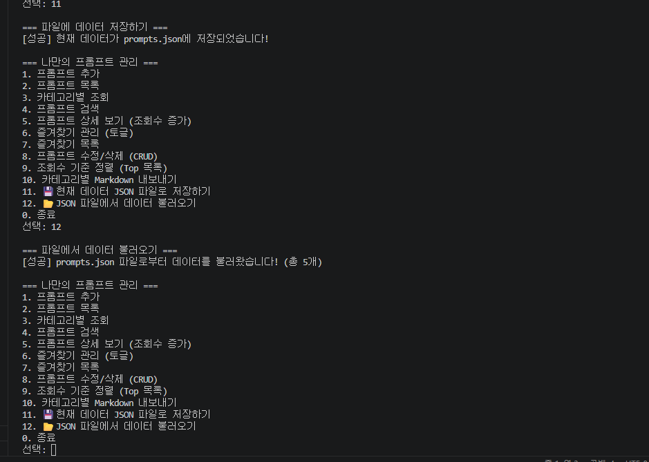

### 17. (보너스) Markdown 내보내기
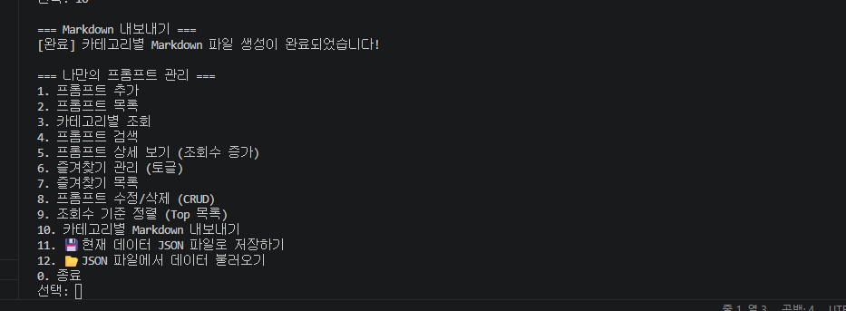

### 18. 데이터 구조 예시
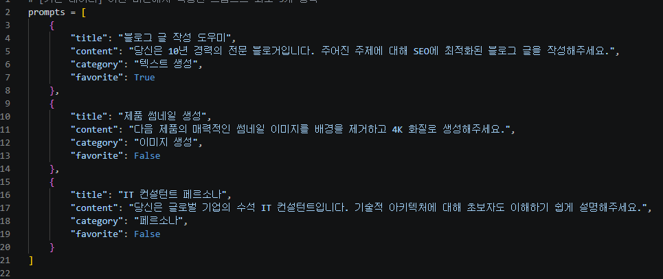

### 19. Git 커밋 로그
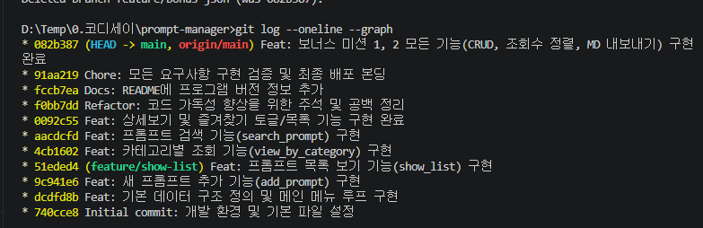